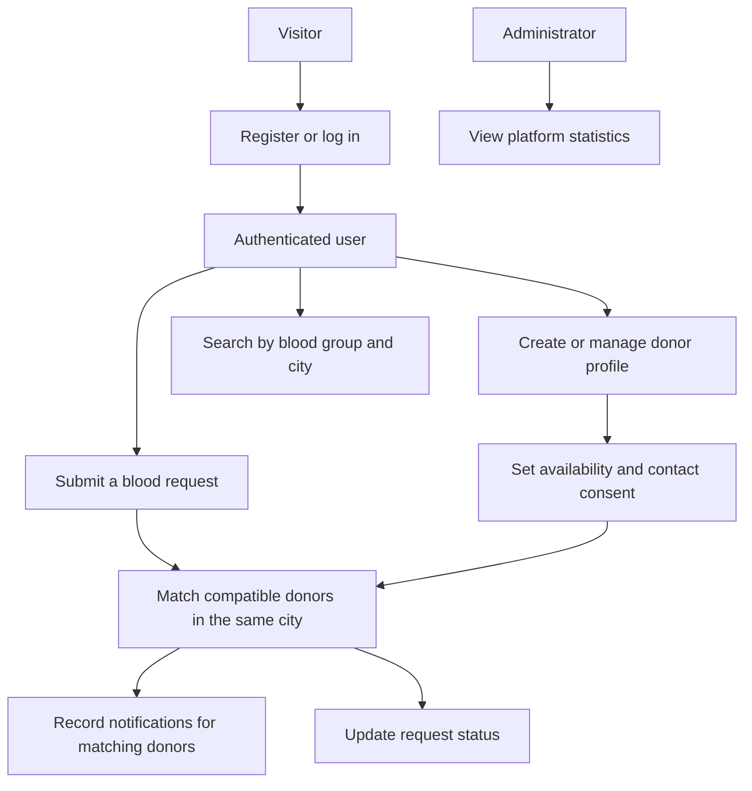

# BloodConnect — Complete Full-Stack Project

**Live demo:** [Open BloodConnect](https://bloodconnect-frontend-np8a.onrender.com)

BloodConnect is a college-ready full-stack blood donation platform with React, Vite,
Tailwind CSS, Node.js, Express, MongoDB Atlas, Mongoose and JWT authentication.

## Project Overview

BloodConnect helps people find compatible blood donors and coordinate blood
requests. Donors can share their blood group and city, manage availability, and
choose whether they can be contacted. Registered users can search for donors or
submit a request; the API matches requests against compatible, available donors
in the same city and records notifications for matching donors.

## Workflow



## What is already included?

### Frontend
- `client/index.html`
- `client/vite.config.js`
- `client/tailwind.config.js`
- `client/postcss.config.js`
- `client/package.json`
- `client/src/main.jsx`
- `client/src/App.jsx`
- `client/src/api.js`
- `client/src/index.css`

### Backend
- `server/package.json`
- `server/server.js`
- `server/middleware/auth.js`
- `server/routes/auth.js`
- `server/routes/donors.js`
- `server/routes/requests.js`
- `server/routes/admin.js`
- `server/models/User.js`
- `server/models/Donor.js`
- `server/models/BloodRequest.js`
- `server/models/Donation.js`
- `server/models/Notification.js`

### Root
- `package.json`
- `.env`
- `.env.example`
- `.gitignore`
- `START_BLOODCONNECT.bat`
- `README.md`

There are no placeholder source files. The React UI, Tailwind configuration,
Express API, JWT middleware, models and routes are included.

## YOUR SETUP

### Step 1 — Open
Extract the ZIP and open the `BloodConnect_Complete` folder in VS Code.

### Step 2 — Edit ONLY `.env`
Open the `.env` file in the ROOT folder.

Change this:
`USERNAME`
and:
`PASSWORD`

to your MongoDB Atlas database username and password.

Do not share your database password in chat or upload `.env` to GitHub.

If the password contains special URL characters such as `@`, `#`, `%`, `/`, `?`
or `:`, URL-encode those characters in the MongoDB URI.

### Step 3 — Start
On Windows, double-click:

`START_BLOODCONNECT.bat`

It installs the packages and starts both frontend and backend.

Or use the VS Code terminal:

```bash
npm install
npm run install-all
npm run dev
```

Open:

`http://localhost:5173`

Backend health check:

`http://localhost:5000/api/health`

The local frontend proxies `/api` to `http://localhost:5000`. For a deployed
frontend, configure the Render services this way:

- API web service: root directory `server`, build command `npm install`, start command `npm start`.
- Frontend static site: root directory `client`, build command `npm install && npm run build`, publish directory `dist`.
- Frontend environment variable: `VITE_API_URL=https://bloodconnect-1-wy0v.onrender.com/api`.
- API environment variable: `CLIENT_URL=https://bloodconnect-frontend-np8a.onrender.com`. Multiple origins can be comma-separated.

Set `MONGODB_URI` and `JWT_SECRET` on the API service as well. After changing
frontend environment variables, trigger a new frontend deploy because Vite
embeds `VITE_API_URL` at build time.

## Main features
- Home page
- Find Blood
- Donor registration
- Patient/requester registration
- Blood requests
- Emergency request matching
- Donor dashboard
- Donor availability
- JWT login
- Password hashing with bcrypt
- Role-based authorization
- Admin statistics API
- MongoDB Atlas persistence
- Responsive Tailwind CSS UI

## Future Improvements
- Add verified donor identity and phone or email verification.
- Deliver donor notifications by email, SMS, or push notification.
- Add privacy controls for donor contact details and request visibility.
- Add automated tests, monitoring, and audit logs for production readiness.

## Developed By

Abhijit Dharmayat

## Important note
This is an educational/college project. A real blood-service platform needs
medical eligibility rules, identity verification, privacy/security controls,
regulatory compliance, verified blood-bank operations and other safeguards.
